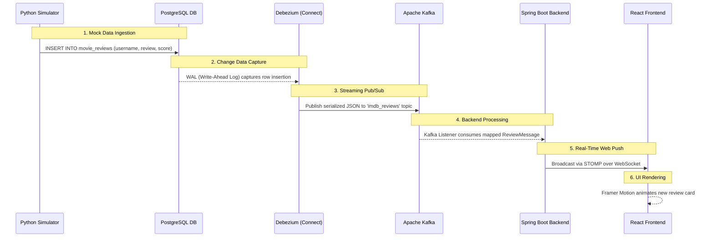

# 🎬 IMDB Real-Time Streaming Data Pipeline


A fully containerized, end-to-end real-time data streaming pipeline and interactive dashboard. This project demonstrates how to capture database changes in real-time using **Change Data Capture (CDC)**, stream them through a message broker, process them, and instantly visualize the results on a modern web client without any polling.

---

## 🚀 Architecture & Data Flow

The system architecture implements an enterprise-grade streaming pipeline. Below is the exact data flow diagram mapping how a single movie review propagates through the entire stack within milliseconds:



### Detailed Pipeline Stages

1. **Python Simulator (`/2-data-simulator`)**: 
   Reads the massive IMDB dataset CSV into memory using Pandas and streams `INSERT` SQL queries into the database with randomized delays to emulate real-world, high-throughput user activity.
2. **PostgreSQL (`/1-infrastructure`)**: 
   Configured specifically with `wal_level=logical`. It serves as the primary operational database storing movie reviews permanently.
3. **Debezium Connect (CDC)**: 
   Attaches directly to PostgreSQL's Write-Ahead Log (WAL). Instead of querying the database, it listens for byte-level changes and streams every new row insert exactly-once to Kafka in real-time.
4. **Apache Kafka (KRaft)**: 
   Acts as the robust, distributed message bus handling the streaming events. Runs natively in KRaft mode (no ZooKeeper dependency).
5. **Spring Boot Processor (`/3-backend-processor`)**: 
   A Java 17 application that serves two primary roles:
   - **Stateful Initialization**: Connects to PostgreSQL via Spring Data JPA to serve aggregate historical data (`/api/stats`) when the UI first loads.
   - **Real-Time Hub**: Asynchronously consumes CDC events from Kafka, maps the JSON payloads, and forwards them directly to the frontend via STOMP WebSockets.
6. **React Dashboard (`/4-frontend-dashboard`)**: 
   An ultra-modern, interactive UI built with Vite and Framer Motion. It maintains an open, long-lived WebSocket connection to display:
   - Live throughput statistics (reviews per minute).
   - Real-time sentiment ratio aggregations (Donut charts, Sparklines).
   - An animated, infinite-scrolling feed of categorized movie reviews.

---

## 🌟 Key Features

* **Zero-Polling Real-Time Feed**: Data arrives at the frontend within milliseconds of database insertion—entirely strictly push-based architecture!
* **Stateful Persistence**: Implements a REST API fetching strategy to initialize the dashboard with historical aggregates directly from PostgreSQL before starting the WebSocket stream, ensuring data survives hard page refreshes.
* **Modern Animated UI**: Includes live throughput stats, sentiment ratio donut charts, sparkline trends, and smooth "slide-in" review cards.
* **Scalable Event-Driven Design**: The decoupled architecture ensures that high database traffic won't bog down the frontend clients. Debezium and Kafka act as shock-absorbers.
* **1-Click Deployment**: The entire infrastructure (6 interconnected containerized services) goes live with a single Docker Compose command.
* **Hot Module Replacement (HMR)**: The frontend container inherently uses volume mounts mapped to the host filesystem for seamless UX/UI code-editing.

---

## 🛠️ Tech Stack

| Layer | Technologies |
| :--- | :--- |
| **Data Source** | Python 3, Pandas, Psycopg2 |
| **Database** | PostgreSQL 15 (Logical Replication Enabled) |
| **Streaming Engine** | Debezium Connect 2.3, Apache Kafka 7.4.0 (KRaft) |
| **Backend** | Java 17, Spring Boot 3, Spring Kafka, Spring WebSocket (STOMP) |
| **Frontend** | React (Vite), Framer Motion, stompjs, sockjs-client |
| **Infrastructure** | Docker, Docker Compose |

---

## 🚦 How to Run

1. Clone this repository:
   ```bash
   git clone <your-repository-url>
   cd imdb-realtime-streaming
   ```

2. Start the entire infrastructure using Docker Compose:
   ```bash
   docker compose up -d --build
   ```

3. **Important**: Register the Debezium Connector so Kafka knows to pull records from PostgreSQL. Wait about 30 seconds for Kafka to fully start, then run:
   ```bash
   curl -X POST -H "Content-Type: application/json" -d @1-infrastructure/register-connector.json http://localhost:8083/connectors
   ```

4. Open your browser and navigate to the dashboard:
   ```
   http://localhost:5173
   ```

5. Watch as the magic happens! The Python simulator will immediately begin injecting data, Debezium will capture the WAL changes, Kafka will route the messages, and the UI will spring to life.

## 📂 Project Structure

```text
📦 imdb-realtime-streaming
 ┣ 📂 1-infrastructure        # DB init scripts and Debezium connector configs
 ┣ 📂 2-data-simulator        # Python script injecting the IMDb dataset
 ┣ 📂 3-backend-processor     # Spring Boot App (Kafka Consumer + WebSocket Hub)
 ┣ 📂 4-frontend-dashboard    # React + Vite Application
 ┗ 📜 docker-compose.yml      # The central orchestrator file tying the stack together
```

## 🎥 Demo

*(Placeholder: Edit and replace this with a `.gif` or link pointing to a video of your animated dashboard!)*

## 🧹 Clean Restart & Teardown

If you want to completely destroy the environment, wipe all data/topics, and start fresh (for instance, to test how the dashboard resets or behaves with an empty database):

1. Spin down and remove all volumes:
   ```bash
   docker compose down --volumes
   ```
2. Re-run the startup command:
   ```bash
   docker compose up -d --build
   ```
3. **Crucial Step**: Because `--volumes` wiped Kafka's internal memory, Debezium "forgot" its configuration. You **must** re-execute Step 3 from the *How to Run* instructions to re-register the connector:
   ```bash
   curl -X POST -H "Content-Type: application/json" -d @1-infrastructure/register-connector.json http://localhost:8083/connectors
   ```

---
*Built to showcase modern Data Engineering and real-time Event-Driven Architecture patterns.*
